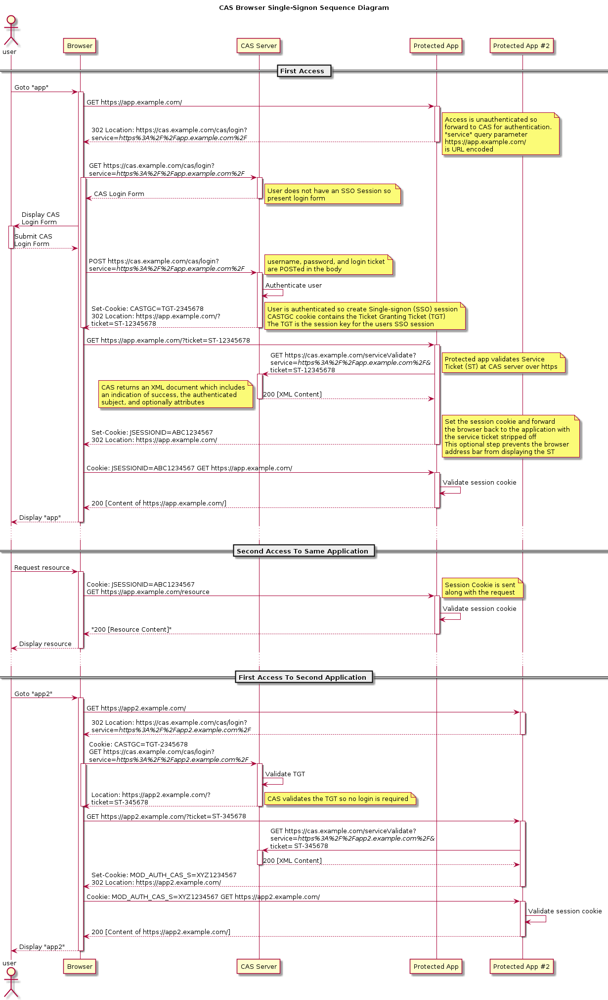
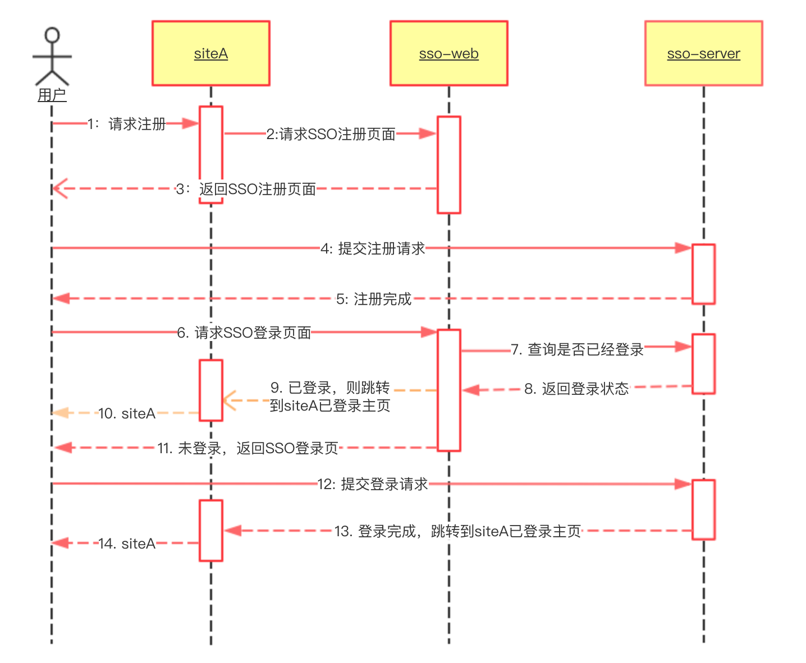
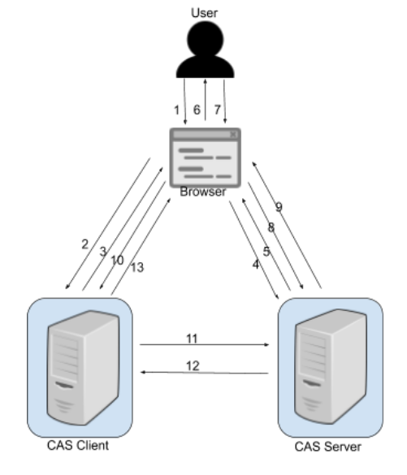
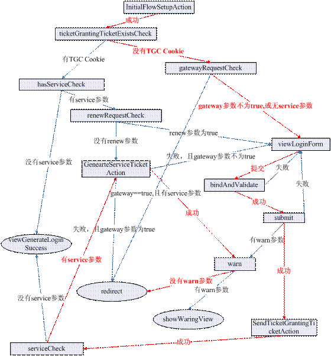
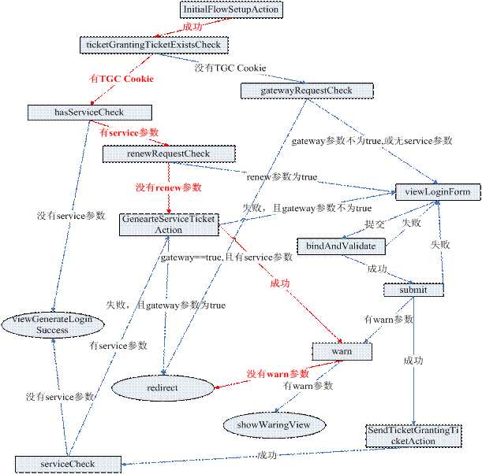

### CAS 

CAS全称为Central Authentication Service即中央认证服务，是一个企业多语言单点登录的解决方案，并努力去成为一个身份验证和授权需求的综合平台。
1、 开源的、多协议的SSO解决方案；Protocols：Custom Protocol、CAS、OAuth、OpenID、RESTful API、SAML1.1、SAML2.0等。
2、 支持多种认证机制：Active Directory、JAAS、JDBC、LDAP、X.509 Certificates 等；
3、 安全策略：使用票据（Ticket）来实现支持的认证协议；
4、 支持授权：可以决定哪些服务可以请求和验证服务票据（ Service Ticket ）；
5、 提供高可用性：通过把认证过的状态数据存储在 TicketRegistry 组件中，这些组件有很多支持分布式环境的实现， 如： BerkleyDB 、 Default 、 EhcacheTicketRegistry 、 JDBCTicketRegistry 、 JBOSS TreeCache 、 JpaTicketRegistry 、 MemcacheTicketRegistry 等；
6、 支持多种客户端： Java 、 .Net 、 PHP 、 Perl 、 Apache, uPortal 等。

https://blog.csdn.net/weixin_42359693/article/details/85400701
https://www.cnblogs.com/gy19920604/p/6029210.html

基于 CAS 实现通用的单点登录解决方案（一）：CAS 原理及服务端搭建[https://laravelacademy.org/post/9774]
基于 CAS 实现通用的单点登录解决方案（二）：CAS 客户端搭建及单点登录测试[https://laravelacademy.org/post/9775.html]
基于 CAS 实现通用的单点登录解决方案（三）：用户单点退出实现[https://laravelacademy.org/post/9777]
对应源码[https://github.com/leo108/laravel_cas_server]

### Git Address

https://github.com/yvesago/castestserver

github.com/apognu/gocas
github.com/shenshouer/cas

Golang NewCASServerConfig示例
 github.com/t3hmrman/casgo

Golang实现的CAS协议Server和Client。
https://github.com/xczh/go-cas

CAS provides a http package compatible client implementation for use with securing http frontends in golang.(documents https://pkg.go.dev/gopkg.in/cas.v2)
https://github.com/go-cas/cas           https://github.com/go-cas/cas/issues/6
https://github.com/byuoitav/cas

https://github.com/tmsong/cas-go-client

************ Implementation of JASIG CAS protocol in Go lang. Supports all protocol versions (v1, v2 and v3).
https://github.com/matthewvalimaki/cas-server

https://github.com/xfali/cas-proxy

https://github.com/zwdgithub/golacas

go gin框架使用cas单点登录
https://blog.csdn.net/qq_37344518/article/details/103288773
### CAS Protocol

https://apereo.github.io/cas/development/protocol/CAS-Protocol.html

TGT (Ticket Granting Ticket)
TGT是CAS为用户签发的登录票据，拥有了TGT，用户就可以证明自己在CAS成功登录过。TGT封装了Cookie值以及此Cookie值对应的用户信息。用户在CAS认证成功后，生成一个TGT对象，放入自己的缓存（Session）；同时，CAS生成cookie（叫TGC，个人理解，其实就是TGT的SessionId），写入浏览器。TGT对象的ID就是cookie的值，当HTTP再次请求到来时，如果传过来的有CAS生成的cookie，则CAS以此cookie值（SessionId）为key查询缓存中有无TGT（Session），如果有的话，则说明用户之前登录过，如果没有，则用户需要重新登录。

TGC （Ticket-granting cookie）
上面提到，CAS-Server生成TGT放入自己的Session中，而TGC就是这个Session的唯一标识（SessionId），以Cookie形式放到浏览器端，是CAS Server用来明确用户身份的凭证。（如果你理解Session的存放原理的话就很好理解）

PGTIOU（Proxy Granting Ticket IOU）
PGTIOU是CAS协议中定义的一种附加票据，它增强了传输、获取PGT的安全性。
PGT的传输与获取的过程：Proxy Service调用CAS的serviceValidate接口验证ST成功后，CAS首先会访问pgtUrl指向的https url，将生成的 PGT及PGTIOU传输给proxy service，proxy service会以PGTIOU为key，PGT为value，将其存储在Map中；然后CAS会生成验证ST成功的xml消息，返回给Proxy Service，xml消息中含有PGTIOU，proxy service收到Xml消息后，会从中解析出PGTIOU的值，然后以其为key，在map中找出PGT的值，赋值给代表用户信息的Assertion对象的pgtId，同时在map中将其删除。

ST（ServiceTicket）
ST是CAS为用户签发的访问某一服务票据。用户访问service时，service发现用户没有ST，则要求用户去CAS获取ST。用户向CAS发出获取ST的请求，如果用户的请求中包含cookie，则CAS会以此cookie值为key查询缓存中有无TGT，如果存在TGT，则用此TGT签发一个ST，返回给用户。用户凭借ST去访问service，service拿ST去CAS验证，验证通过后，允许用户访问资源。
为了保证ST的安全性：ST是基于随机生成的，没有规律性。而且，CAS规定ST只能存活一定的时间，然后CAS Server会让它失效。而且，CAS协议规定ST只能使用一次，无论Service Ticket验证是否成功，CASServer都会清除服务端缓存中的该Ticket，从而可以确保一个Service Ticket不被使用两次。

### CAS Process

1、Client(终端用户)在浏览器里请求访问Web应用example；
2、浏览器发起一个GET请求访问example应用的主页https://www.example.com；
3、应用example发现当前用户处于未登陆状态，Redirect用户至CAS服务器进行认证；
4、用户请求CAS服务器；
5、CAS发现当前用户在CAS服务器中处于未登陆状态, 要求用户必须得先登陆；
6、CAS服务器返回登陆页面至浏览器；
7、用户在登陆界面中输入用户名和密码（或者其他认证方式）；
8、用户把用户名和密码通过POST，提交至CAS服务器；
9、CAS对用户身份进行认证，若用户名和密码正确，则生成SSO会话,  且把会话ID通过Cookie的方式返回至用户的浏览器端（此时，用户在CAS服务端处于登陆状态）；
10、CAS服务器同时也会把用户重定向至CAS Client, 且同时发送一个Service Ticket；
11、CAS Client的服务端收到这个Service Ticket以后，请求CAS Server对该ticket进行校验；
12、CAS Server把校验结果返回给CAS Client, 校验结果包括该ticket是否合法，以及该ticket中包含对用户信息；
13、至此，CAS Client根据Service Ticket得知当前登陆用户的身份，CAS Client处于登陆态。

https://apereo.github.io/cas/6.2.x/protocol/CAS-Protocol-Specification.html

### CAS 服务端的处理逻辑

CAS 默认的登录处理流程

第一次访问Web 应用的流程走向

已经登录web1 后，访问web1 的资源（web1 没有启动session ），或访问web2 的资源

1 ： InitialFlowSetupAction: 是流程的入口。用 request.getContextPath() 的值来设置 cookie 的 Path 值， Cookie 的 path 值是在配置文件里定义的，但这个 Action 负责将 request.getContextPath() 的值设置为 Cookie 的 path 值，这是在 cas 部署环境改变的情况下，灵活地设置 cookie path 的方式；把 cookie 的值以及 service 参数的值放入 requestContext 的 flowscope 里。

2 ： GenerateServiceTicketAction 此 Action 负责根据 service 、 GTC cookie 值生成 ServiceTicket 对象， ServiceTicket 的 ID 就是返回给客户应用的 ticket 参数，如果成功创建 ServiceTicket ，则转发到 WarnAction ，如果创建失败，且 gateway 参数为 true ，则直接redirect 到客户应用， 否则则需要重新认证。

3 ： viewLoginForm 这是登录页面， CAS 在此收集用户凭证。 CAS 提供的默认实现是 /WEB-INF/view/jsp/simple/ui/casLoginView.jsp 。

4 ： bindAndValidate 对应 AuthenticationViaFormAction 的 doBind 方法，该方法负责搜集登录页面上用户录入的凭证信息（用户名、密码等），然后把这些信息封装到 CAS 内部的 Credentials 对象中。用户在 casLoginView.jsp 页面上点击提交后，会触发此方法。

5:submit   对应 AuthenticationViaFormAction 的 submit 方法 , 如果 doBind 方法成功执行完， 则触发 submit 方法，此方法负责调用centralAuthenticationService 的      grantServiceTicket 方法，完成认证工作，如果认证成功，则生成 TicketGrantingTicket 对象，放在缓存里， TicketGrantingTicket 的 ID 就是 TGC Cookie 的 value 值。

6 ： warn  CAS 提供了一个功能：用户在一个 web 应用中跳到另一个 web 应用时， CAS 可以跳转到一个提示页面，该页面提示用户要离开一个应用进入另一个应用，可以让用户自己选择。用户在登录页面 viewLoginForm 上选中了 id=”warn” 的复选框，才能开启这个功能。

WarnAction 就检查用户有没有开启这个功能，如果开启了，则转发到showWarnView, 如果没开启，则直接redirect 到客户应用。

7 ：SendTicketGrantingTicketAction 此Action 负责为response 生成TGC Cookie ，cookie 的值就是 AuthenticationViaFormAction 的submit 方法生成的 TicketGrantingTicket 对象的 ID 。

8 ： viewGenerateLoginSuccess 这是 CAS 的认证成功页面。