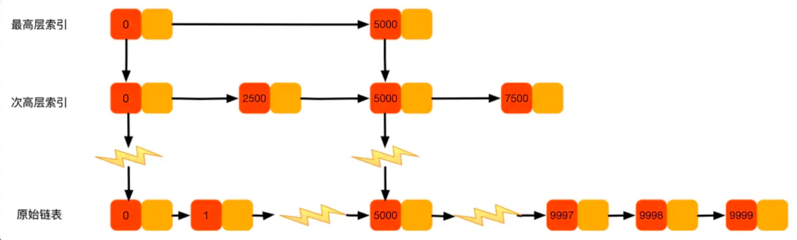

跳表（skiplist）是一种随机化的数据， 由 William Pugh 在论文Skip lists: a probabilistic alternative to balanced trees中提出。 跳表以有序的方式在层次化的链表中保存元素， 效率和平衡树媲美——查找、删除、添加等操作都可以在O(logN)期望时间下完成， 综合能力相当于平衡二叉树。比起平衡树来说， 跳跃表的实现要简单直观得多，核心功能在200行以内即可实现，遍历的时间复杂度是O(N)。代码简单、空间节省，在挺多的场景得到应用。

SkipList用于需要有序的场合。在不需要有序的场景下，go自带的map容器依然是优先选择。

跳表原理示意图：

